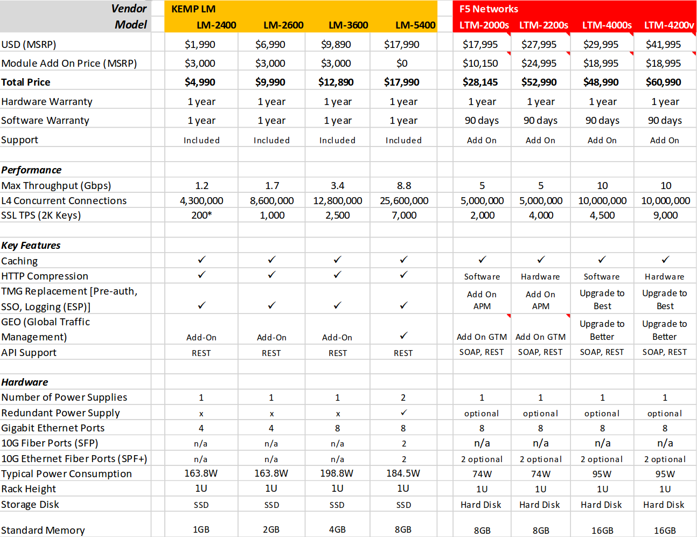
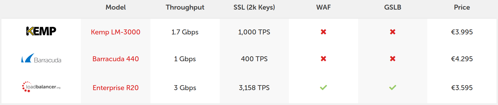
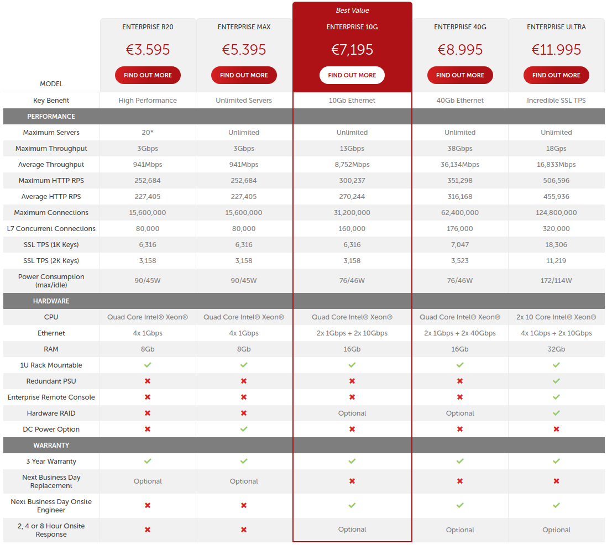

### Ejercicio 1

#### Buscar información sobre cuánto costaría en la actualidad un mainframe que tuviera las mismas prestaciones que una granja web con balanceo de carga y 10 servidores finales (p.ej).
Comparar precio y potencia entre esa hipotética máquina y la granja web de unas prestaciones similares.

En los sistemas mainframe básicos, como nuestro ejemplo, los precios comienzan en torno a los 40.000 dólares. Este precio se calcula según los núcleos de CPU, el hardware restante y licencias de software. Sin embargo, los grandes sistemas pueden subir por encima de un millón de dólares.

Existen unas tablas, donde se recoge una detallada inforamación acerca de los *IBM Mainframes*. Por ejemplo: 

	IBM zEnterprise EC12 2827 Mainframe Reference	
	<http://www.tech-news.com/publib/pl2827.html>

- - -

### Ejercicio 2

#### Buscar información sobre precio y características de balanceadores comerciales (hardware) específicos. Compara las prestaciones que ofrecen unos y otros.

Existen distintos tipos de balanceadores hardware, como detallé en el ejercicio 4, correspondiente al T2. No obstante, podemos añadir algunas tablas comparativas, que resumen características y precios de mercado:

En general, este tipo de balanceadores de carga (hardware), presentan características comunes:

	· Layer 4 and Layer 7 Load Balancing and Cookie Persistence
    · SSL Offload/SSL Acceleration
    · Application Acceleration: HTTP Caching, Compression & IPS Security
    · Full HTTP/2 support
    · WAF - Web Application Firewall
    · Global Server Load Balancing
    · Edge Security Pack (Microsoft TMG Replacement)
    · Application Health Checking
    · Adaptive (Server Resource) Load Balancing
    · Content Switching

- - -

### Ejercicio 3

#### Implementar un pequeño servicio web en los servidores finales que devuelva el % CPU y % RAM que en un instante tiene en uso dicho servidor. Lo debe devolver como una cadena de texto plano que representa ambos porcentajes, p.ej: “CPU 45% RAM 76%”

He utilizado un pequeño programa, escrito en php, que nos aporta los resultados necesarios:

	<HTML>
	<HEAD><title> · tarsot's Web Servers · </title></HEAD>
	<BODY>
	<H1>SWAP SSL WebServer. It works! :-)</H1>
	<?php

	        echo "<h2>
* Web Server Stats:
</h2>";

	        // Server Memory Usage
	        function getServerMemoryUsage(){

	                $free = shell_exec('free');
	                $free = (string)trim($free);
	                $free_arr = explode("\n", $free);
	                $mem = explode(" ", $free_arr[1]);
	                $mem = array_filter($mem);
	                $mem = array_merge($mem);
	                $memory_usage = $mem[2]/$mem[1]*100;

	        return $memory_usage;
	        }

	        echo "<strong>· Server Memory Usage: </strong>";
	        echo round(getServerMemoryUsage(),2);
	        echo "%";

	        // Server CPU Usage
	        function getServerCpuUsage(){

	                $load = sys_getloadavg();

	        // Uptime: third column
	        return $load[1];
	        }

	        echo "
";
	        echo "<strong>· Server CPU Usage: </strong>";
	        echo round(getServerCpuUsage(),2);
	        echo "%";

	?>
	</BODY>
	</HTML>

- - -

### Ejercicio 4

#### Buscar información sobre los métodos de balanceo que implementan los dispositivos recogidos en el ejercicio 4.2 (o el software que hemos propuesto para la práctica 3).

Las posibles configuraciones, de estos dispositivos, permiten disponer de diferentes algoritmos de balanceo de carga. Aparte de *Round Robin, Ratio, nenor número de conexiones, etc.*, también utilizan estos métodos:

* Observado: Este método es como el ratio, pero aquí el ratio no se asigna manualmente al servidor. Si no la relación más alta con el servidor que tiene menos que el promedio de conexiones de capa 4 y la relación más baja con el servidor que tiene más que el promedio de conexiones.

* Predictivo: En este método, se mide el tiempo que un servidor tarda en progresar la petición o en responder al cliente y también calcula un valor de ratio dinámico basado en el número de conexiones L4 a cada servidor.

* Fallback Host (HTTP): En este método, si todos los servidores fallan, entonces el cliente puede ser enviado a la redirección HTTP. 

- - -

### Ejercicio 5

#### Probar las diferentes maneras de redirección HTTP. ¿Cuál es adecuada y cuál no lo es para hacer balanceo de carga global? ¿Por qué?

* Redirección 301 (movido permanentemente): Cuando la página web, sobre la que se hace la petición, ha sido 'movida permanentemente' hacia una dirección distinta, es decir, hacia otra URL. Esta redirección es muy común en casos de migraciones web desde un dominio antiguo a un nuevo dominio o, como vimos antes, ante eliminaciones de URLs.

	- Se usa cuando queremos eliminar una URL de forma permanente.
	- Es la redirección que se indexa con más rapidez y la que traspasa más autoridad.
	
* Redirección 302 (encontrado): Cuando la página web, sobre el que se hace la petición, ha sido ‘encontrada‘ pero reside temporalmente en una dirección distinta, es decir, en otra URL.

	- El principal inconveniente, es que esta redirección traspasa el 0% del *link juice* o técnica que se aplica para trasladar autoridad a diferentes URLs, gracias a la inclusión de enlaces internos. Lo que se conoce como traspaso de autoridad de página o, precisamente, *Page Rank*.

* Redirección 303 (ver otro): se da cuando, al hacer la petición sobre una página web, el servidor lleva al usuario a 'ver otro' recurso.
	
	- El servidor encuentra el recurso pero envía al user-agent a ver otro distinto.
	- Parece ser que este tipo de redirección no pasa autoridad.

* Redirección 307 (redirección temporal): se da cuando la página web a la que se ha hecho la petición hace una ‘redirección temporal‘ hacia otra url. La diferencia con la *redirección 302* es el carácter ‘encontrado’ de la URL original; en el caso de la redirección 307, indica que la URL solicitada ha sido movida a una ubicación temporal y volverá en un rato.

Tanto la 302 como la 307, pueden utilizarse para GSLB, puesto que permiten redirección a otra página web alternativa y es posible reutilizar la URL original en el futuro.

- - -

### Ejercicio 6

#### Buscar información sobre los bloques de IP para los distintos países o continentes. Implementar en JavaScript o PHP la detección de la zona desde donde se conecta un usuario.

La geolocalización, de direcciones IP, es una técnica utilizada para estimar la ubicación geográfica  de un dispositivo conectado a Internet utilizando la dirección IP del mismo.  Este mecanismo depende de que la dirección IP del dispositivo figure en una base de datos con su respectiva ubicación, dirección postal, ciudad, país, región o coordenadas geográficas son algunos de los niveles de detalle que se pueden registrar. Por ejemplo, puede consultarse en: <a href="https://dev.maxmind.com/geoip/geoip2/geolite2/">Geolite2</a>

Para PHP, podemos utilizar el siguiente código:

	<?php 
	
		if($_SERVER["HTTP_X_FORWARDED_FOR"]){ 

			echo "La dirección Ip de tu proxy es: {$_SERVER['REMOTE_ADDR']} "; 
			echo "Tu dirección IP real es: {$_SERVER['HTTP_X_FORWARDED_FOR']}"; 
		
		}else{ 

			echo "Tu dirección IP es: {$_SERVER['REMOTE_ADDR']}";} 
	?> 

Al acceder a una página usando un proxy, la variable "REMOTE_ADDR" devuelve la dirección IP del proxy. La IP original, es posible conocerla en caso que no sea un proxy verdaderamente anónimo (son pocos y caros) usando la variable: "HTTP_X_FORWARDED_FOR", es lo que hace el parámetro anterior.

Aparte, podemos consultar esta información en:

* <https://www.countryipblocks.net/>
* <https://www.nirsoft.net/countryip/>
* <https://www.lacnic.net/3105/1/lacnic/geolocalizacion-de-ips>

- - -

### Ejercicio 7

#### Buscar información sobre métodos y herramientas para implementar GSLB.

Este tipo de mecanismo permite distribuir el tráfico entre diversos servidores que (normalmente) se encuentran en diferentes ubicaciones geográficas. La idea es tener un servidor/motor de equilibrio global que reciba solicitudes de tráfico y las redireccione a ciertas ubicaciones, utilizando los criterios/algoritmos seleccionados y configurados por el administrador. Dos de los métodos más conocidos son:

· CDN: Red de entrega de contenido (CDN) emitida para entregar contenido y medios enriquecidos como imágenes y videos, la CDN distribuye contenido en nodos geográficamente dispersos, manteniendo la menor latencia y las velocidades más altas. Normalmente se implementa cuando se deben distribuir partes particulares de contenido en lugar de sitios web y aplicaciones enteras. 
    
· NetScaler VPX: Al igual que con el equilibrio de carga local normal, VPX utiliza una jerarquía de objetos similar para equilibrar la carga de tráfico entre varias geografías. Utilizando búsquedas globales, basadas en DNS, NetScaler elige el registro respectivo que corresponde a la ubicación/sitio seleccionado.