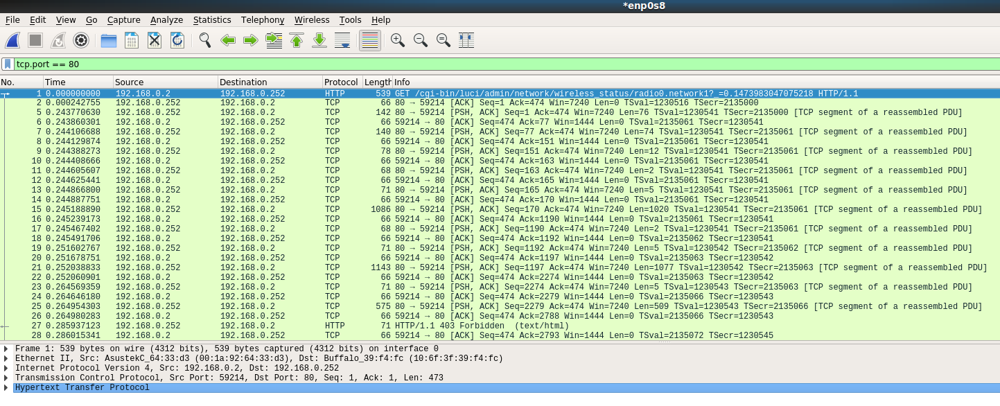

### Ejercicio 1

#### Buscar información sobre cómo calcular el número de conexiones por segundo.

	netstat -an | grep :80 | sort
	netstat | grep http | wc -l
	
	Para empezar, podéis revisar las siguientes webs:

	http://bit.ly/1ye4yHz
	http://bit.ly/1PkZbLJ
	http://bit.ly/2nGm3MR

Igualmente, sobre el puerto HTTPS, observamos el estado de la conexión:

	$ netstat -an | grep :443 | sort
	tcp6       0      0 192.168.0.110:443       217.21x.xx.230:43412    FIN_WAIT2  
	tcp6       0      0 192.168.0.110:443       217.21x.xx.230:43414    FIN_WAIT2  
	tcp6       0      0 :::443                  :::*                    LISTEN     
	$ netstat | grep https | wc -l
	2
	$ netstat -an | awk '{print $4}' | grep -c 443
	1

Complementariamente, podemos obtener una serie de parámetros diversos, si recurrimos al módulo de estado de Apache. Este permite averiguar el rendimiento del servidor, mostrando una página HTML que proporciona las estadísticas actuales del mismo en un formato de fácil lectura.

Como ejemplo, para una página protegida por contraseña, modificamos el archivo /etc/httpd/conf/httpd.conf como sigue:

	ExtendedStatus on
	<Location /server-status>
	SetHandler server-status
	AuthType basic
	AuthName "Apache status"
	AuthUserFile /etc/httpd/conf/server-status_htpasswd
	Require valid-user
	</Location>

Por otro lado, el uso del comando *ipstate*, nos ofrece información de las conexiones entrantes, salientes y reenviadas (o enrutadas). De modo que, se determinan las direcciones IP fuente y destino, ambas con su respectivo puerto, protocolo, estado de la conexión y el TTL. Por ejemplo:

	$ iptstate -sdb s | less # Ordena por estado
	$ iptstate -sdb d | less # Ordena por IP destino
	$ iptstate -sdb p | less # Ordena por protocolo

- - -

### Ejercicio 2

#### Revisar los análisis de tráfico que se ofrecen en: <a href="http://bit.ly/1g0dkKj" target="_blank">Protocolos, Análisis de Tráfico y Simulaciones de Red</a>. Instalar wireshark y observar cómo fluye el tráfico de red enuno de los servidores web mientras se le hacen peticiones HTTP... o en la red de casa.

Para este ejercicio, instalamos Wireshark sobre cualquier equipo y, con privilegios de *root*, comenzamos a capturar los paquetes que llegan a través de la interfaz de red principal por el puerto 80. Ver imagen adjunta:

Desde dicha captura, observamos cómo se establece la conexión TCP cuando realizamos la petición al navegador a través del puerto 80 y hacia la IP del router, en este caso. Esto es, el cliente inicia la conexión HTTP enviando un paquete TCP SYN al puerto 80 del servidor web (router OpenWRT) y este envía un paquete ACK al cliente
seguido de otro SYN. Finalmente, el cliente envía un paquete ACK como respuesta.

- - -

### Ejercicio 3

#### Buscar información sobre características, funcionalidad, disponibilidad para diversos SO, etc. de herramientas para
monitorizar las prestaciones de un servidor. Para empezar, podemos comenzar utilizando las clásicas de:

* Linux:

	* top / htop (versión mejorada)
	* vmstat
	* netstat

Existen muchas otras herramientas GUI, que nos permiten recoger estadísticas mucho más completas:

* Zabbix: solución de monitoreo de Linux de código abierto para una amplia gama de infraestructura de TI, servicios, aplicaciones, máquinas virtuales, recursos en la nube, etc. Proporciona métricas de monitoreo comprensibles para una red y utilización del sistema, CPU y carga de recursos, memoria y consumo de espacio en disco, etc.

* Acronis Monitoring Service: una de las herramientas de monitorización más populares en la actualidad, dirigida a sistemas basados en IaaS. Permite realizar comprobaciones tanto externas como internas.

* New Relic: una de la mejores herramientas para monitorizar el rendimiento de las aplicaciones de forma detallada. Es muy completa, ya que realiza la monitorización de un amplio abanico de parámetros, incluida la experiencia de los usuarios finales. Además, muchos de los parámetros están disponibles en tiempo real.

* Logic Monitor: la solución adecuada para infraestructuras de gran tamaño. Monitoriza una gran selección de hardware de red, así como de recursos de software. Tiene compatibilidad con más de 1.000 tecnologías diferentes.

* Nagios: también es de código abierto y muestra una gran flexibilidad. Permite monitorizar una gran variedad de parámetros, e incluso enviar informes detallados a través del correo electrónico.

* Icinga: indicada para sistemas distribuidos, comprueba la disponibilidad de los diferentes servicios de red y genera una serie de informe de rendimiento. Su principal ventaja es que es capaz de trabajar en todo tipo de entornos; desde pequeñas infraestructuras TIC hasta otras mucho más complejas.

* Sensu: esta herramienta de monitorización destaca por su interfaz gráfica, de modo que es muy visual. Se puede hacer uso de ella para distintos servidores.

Aparte de las propuestas, algunas de las mejor valoradas actualmente, pueden encotrarse en esta <a href="https://www.pcwdld.com/best-server-monitoring-tools-software-windows-linux" target="_blank">comparativa.</a>