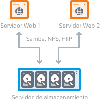
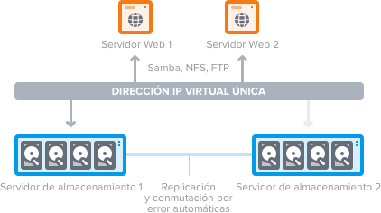
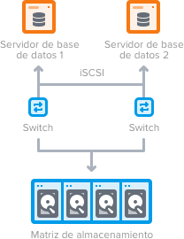
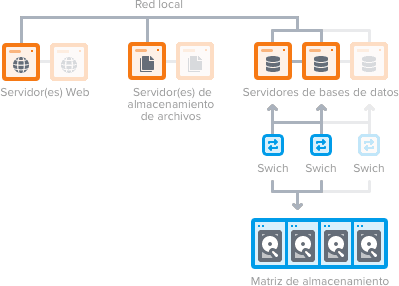

### Ejercicio T7.1

#### Buscar información sobre los sistemas de ficheros en red más utilizados en la actualidad y comparar sus características. Hacer una lista de ventajas e inconvenientes de todos ellos, así como grandes sistemas en los que se utilicen.

Este tipo de sistemas, permiten conectar a ficheros remotos como si se tratara de un medio de almacenamiento local. De tal modo que, el equipo cliente, puede acceder con independencia del sistema de archivos de disco que se utiliza en el servidor.

* SMB/CIFS: es el sistema nativo de Windows. Permite navegar por los recursos ofrecidos y está orientado al funcionamiento en LAN.

* NFS: es el sistema nativo de Unix. No está pensado para navegar por los recursos y funciona en WAN.

* Almacenamiento conectado a la red (NAS): que permite conectar múltiples servidores web a un servidor de almacenamiento dedicado centralizado. Cada servidor web accede a los mismos datos, para obtener una experiencia de usuario unificada y la integridad de los datos. Dividir el almacenamiento y servidores web, también nos permite especializar el hardware del servidor de almacenamiento (al igual que usar alta capacidad del disco y RAID de hardware), y administrar el almacenamiento y servicios web independientemente.

* NAS redundante: que agrega un segundo servidor de almacenamiento con conmutación por error e incluye una copia (en caliente) de los datos. Ambos están configurados en la misma red local y comparten una misma dirección IP. Si alguno de los dos servidores de almacenamiento redundante no están disponibles, los servidores web todavía tendrán acceso a sus datos en el servidor de conmutación por error.

* Red de área de almacenamiento (SAN): que proporciona una serie redundante de discos, considerados como un volumen local por la web o por los servidores de bases de datos que conecte a ella. Al igual que una arquitectura NAS, la red proporciona datos de forma unificada. Pero una SAN puede ser aún más rápida para el almacenamiento intensivo de E/S y el alojamiento de bases de datos, ya que se ve como un volumen local.

* Clúster de alta disponibilidad (HA): que consiste en dos o más de cada uno de los servicios: servidores web, almacenamiento de archivos y servidores de bases de datos, con distribución de tráfico mediante un balanceador de carga. Este garantiza que el tráfico se envíe al servidor en funcionamiento de conmutación por error, en caso de fallos en el hardware o la aplicación. Es el mismo caso para sus servidores web o de bases de datos.

* Entornos Cloud híbridos: con una solución de Cloud Híbrida, se puede enlazar un servidor de almacenamiento dedicado, privado y de alta capacidad con servidores cloud públicos flexibles en una solución híbrida. 

* Cloud Storage:

	* Almacenamiento de objetos: como Amazon S3, ideal para crear aplicaciones modernas desde cero que requieren escala y flexibilidad, y que también pueden utilizarse para importar almacenes de datos existentes para su análisis, copia de seguridad o archivo.

	* Almacenamiento de archivos: a menudo, este tipo de almacenamiento cuenta con un servidor de almacenamiento conectado a la red (NAS). Por ejemplo, Amazon EFS, Amazon FSx for Windows File Server y Amazon FSx for Lustre, son perfectas para los casos de uso como repositorios de contenido grandes, entornos de desarrollo, almacenes de contenido multimedia y carpetas de usuario. Además, Amazon FSx for Lustre se destina a para cargas de trabajo de aprendizaje automático y de alto rendimiento.

	* Almacenamiento en bloques: sistemas de planificación de recursos empresariales (ERP), a menudo requieren almacenamiento dedicado y de baja latencia para cada host. Esto es similar al almacenamiento conectado directamente (DAS) o a una red de área de almacenamiento (SAN). Las soluciones de almacenamiento en la nube basadas en bloques, como Amazon Elastic Block Store (EBS), se aprovisionan con cada servidor virtual y ofrecen la latencia ultrabaja necesaria para cargas de trabajo de alto rendimiento.

* GlusterFS: es un sistema multiescalable de archivos para NAS desarrollado inicialmente por Gluster Inc. Este permite agregar varios servidores de archivos sobre Ethernet o interconexiones Infiniband RDMA en un gran entorno de archivos de red en paralelo. El diseño del GlusterFS se basa en la utilización del espacio de usuario y de esta manera no compromete el rendimiento. Se pueden encontrar siendo utilizado en una gran variedad de entornos y aplicaciones como computación en nube, ciencias biomédicas y almacenamiento de archivos. 

	La mayor parte de la funcionalidades del GlusterFS se implementa como traductores, incluyendo:

	* Espejado y la replicación de archivos.
	* Fragmentación de los archivos o Data striping.
	* Balanceo de carga para la lectura y escritura de archivos.
	* Volúmenes con tolerancia a fallos.
	* Planificación de E/S y almacenamiento en caché de disco.
	* Las cuotas de almacenamiento

* Coda: es un sistema de ficheros distribuido que tiene sus orígenes en AFS2. Tiene múltiples características que son deseables en la mayoría de sistemas de archivos. Además, tiene algunas características propias:

	* Puede funcionar sin conexión.
	* Es software libre.
	* Gran rendimiento gracias a la caché persistente en el cliente.
	* Replicado de servidores.
	* Modelo de seguridad para autenticación, cifrado y control de acceso.
	* Funcionamiento continuado durante fallos de red.
	* Ajuste del ancho de banda de red.
	* Escala bien.

	Coda utiliza una caché local para proporcionar acceso a los datos del servidor cuando ocurren desconexiones en la red. Durante el funcionamiento normal, un usuario lee y escribe al sistema de archivos con normalidad, mientras el cliente obtiene todos los datos que ha marcado como importantes en el caso de una desconexión de red. Cuando se pierde la conexión de red, el cliente Coda sirve los datos desde su caché local y registra cualquier actualización. A este estado se le llama funcionamiento sin conexión. Al restablecerse la conexión, el cliente Coda pasa del funcionamiento sin conexión hacia un estado transitorio de "reintegración" donde las actualizaciones registradas se envían a los servidores. Cuando todas las actualizaciones se han reintegrado, el cliente vuelve al estado normal de funcionamiento con conexión.

* InterMezzo: es un sistema de archivos distribuido para Linux, distribuido bajo la licencia GPL. A partir de la versión 2.4.15 del núcleo Linux se incluye soporte para InterMezzo en el kernel standard. InterMezzo está diseñado para trabajar encima de un sistema de archivos con registro como ext3, JFS, ReiserFS y XFS.

	Un sistema InterMezzo consiste en un servidor, que mantiene la copia maestra del sistema de archivos, y uno o más clientes con una caché del sistema de archivos. Puede trabajar en el modo de replicación, en el que un cliente mantiene un duplicado completo del sistema de archivos, o en el modo bajo demanda en el que el cliente sólo solicita los ficheros que necesita. Lo que se logra al capturar todas las escrituras al sistema de archivos con registro del servidor difundiéndolas a los clientes para que las reproduzcan.

	Se describe como un "sistema de archivos de gran disponibilidad" ya que un cliente puede trabajar incluso si se pierde la conexión con el servidor. Durante el periodo de desconexión, se registran las actualizaciones que se propagarán al restaurar la conexión. Los conflictos se detectan y manejan de acuerdo a la "política de resolución de conflictos" (aunque la mejor política puede ser evitar los conflictos).

	* Aplicaciones típicas para el modo de replicación pueden ser:

		* Un cluster de servidores trabajando sobre un sistema de archivos compartido.
		* Ordenadores que no siempre están conectados a la red, como los portátiles.

	* Aplicaciones típicas para el modo bajo demanda pueden ser:

		* Servidores de ficheros distribuidos, es decir, se pueden realizar réplicas de servidores FTP o WWW remotos sin tener que propagar ficheros a los que nunca se accede.
		* Estaciones de trabajo de escritorio.

* Lustre: es un sistema de archivos distribuido Open Source, normalmente utilizado en clusters a gran escala. El nombre es una mezcla de Linux y clusters. El proyecto intenta proporcionar un sistema de archivos para clusters de decenas de miles de nodos con petabytes de capacidad de almacenamiento, sin comprometer la velocidad o la seguridad, y está disponible bajo la GNU GPL.

	Muchos de los superordenadores más rápidos del mundo son clusters que utilizan el sistema de archivos Lustre como almacenamiento, como los sistemas en ORNL, PNNL, LLNL y LANL.

	Se considera a cada archivo almacenado en el sistema de archivos Lustre un objeto. Lustre presenta a todos los clientes una semántica POSIX estándar y acceso concurrente lectura y escritura para los objetos compartidos. Un sistema de archivos Lustre tiene cuatro unidades funcionales. Estas son: Meta data server (MDS) para almacenar los metadatos; un Object storage target (OST) para guardar los datos reales; un Object storage server (OSS) para manejar los OSTs; cliente(s) para acceder y utilizar los datos. Los OSTs son dispositivos de bloques. Un MDS, OSS, y un OST pueden residir en el mismo nodo o en nodos diferentes. Lustre no administra directamente los OSTs, y delega esta responsabilidad en los OSSs para asegurar la escalabilidad para grandes clusters y supercomputadores.

Cualquiera de los sistemas de archivos distribuidos, comentados anteriormente, poseen una serie de ventajas frente a otros. Esto se debe a que sirven para compartir archivos y otros recursos como un almacenamiento persistente en una red de computadoras.