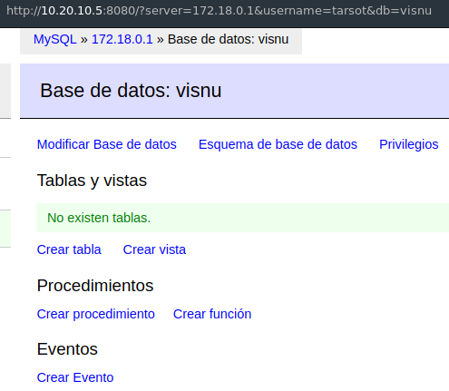

<link rel="StyleSheet" href="./StyleSheet/syntax.css" type="text/css">

## · Granja Web Docker sobre arquitectura ARM ·

### 1. Introducción

Docker es un sistema de código abierto, con un modelo de implementación basado en imágenes, que automatiza el despliegue de aplicaciones dentro de contenedores de software basados en Linux. Se usa el kernel y las funciones del sistema para segregar los procesos, de modo que puedan ejecutarse de manera independiente. Así se hace un mejor uso de su infraestructura y preserva la seguridad que tendría con sistemas separados.

Se desarrolló a partir de la tecnología LXC, como virtualización ligera o lo que asociamos con contenedores de Linux "tradicionales", que usan un sistema *init* que puede gestionar varios procesos. Esto significa que las aplicaciones completas se pueden ejecutar como una sola. La tecnología Docker pretende que las aplicaciones se dividan en sus procesos individuales y ofrece las herramientas para hacerlo. Aparte, facilita el proceso de creación y diseño de contenedores, de envío de imágenes y de creación de versiones de imágenes, entre otras cosas.

En resumen, estas son algunas de las principales características y funcionalidades de Docker:

* Autogestión de los contenedores.
* Fiabilidad.
* Aplicaciones libres de las dependencias instaladas en el sistema anfitrión.
* Capacidad para desplegar multitud de contenedores en un mismo equipo físico.
* Puesta en marcha rápida de los servicios que necesitamos.
* Contenedores muy livianos que facilitan su almacenaje, transporte y despliegue.
* Capacidad para ejecutar una amplia gama de aplicaciones.
* Compatibilidad multi-sistema, ya que podremos desplegar nuestros contenedores en multitud de plataformas.

 Además, contamos con un conjunto de herramientas que nos facilita su uso:

* **Docker Machine**: para poder crear y gestionar un conjunto de máquinas docker.
* **Docker Compose**: para poder gestionar un conjunto de contenedores.
* **Docker Swarm**: para poder crear un clúster de máquinas docker.

### 2. Justificación

#### Contenedor vs. máquina virtual

Mientras que en una máquina virtual se virtualiza todo el servidor, incluido el sistema operativo completo, un contenedor solo contiene los archivos necesarios para su funcionamiento. Esto, hace que el uso de contenedores sea mucho más eficiente en el consumo de recursos hardware vs. las máquinas virtuales tradicionales. Los contenedores permiten desplegar aplicaciones más rápido y aprovechar mejor los recursos de hardware. Las máquinas virtuales nos permiten crear sistemas completos totalmente aislados, con mayor control sobre el entorno y mezclando sistemas operativos host y huésped.

Cada tecnología tiene sus aplicaciones y sus ventajas según las necesidades y circunstancias de cada desarrollo. En la actualidad, los contenedores nos permiten orquestar y controlar los despliegues con mucha partes en movimiento, como el caso de Kubernetes. De hecho, se están convirtiendo en una tecnología indispensable y cada vez se utilizan para más cosas, no solo para desplegar aplicaciones en producción, sino también para crear entornos de desarrollo replicables entre todos los miembros de un equipo.  

#### ARM vs. x86

La diferencia entre ARM y x86, se da principalmente en la complejidad de su composición: mientras que el x86 es desarrollado a partir de una arquitectura CISC (Complex Instrucion Set Computers) más compleja, un procesador ARM está basado en RISC (Reduced Instruction Set Computer), con el objetivo de ser más simple. Además, este tipo de procesador ARM (Advanced Risc Machine) está diseñado para tener un consumo mínimo de energía y sin demasiada pérdida de poder de procesamiento.

En el trabajo final, que se cita a continuación, se ha optado por incluir esta tecnología. Aparte de las ventajas, señaladas anteriormente, no es necesario el uso de monitores y/o GPU específicas.

### 3. Networking

Como se aprecia en el esquema de red, la Granja Web se ha diseñado a partir de una arquitectura ARM dentro de una tecnología de creación de contenedores basada en Docker, principalmente. No obstante, la infraestructura es algo más compleja y se han añadido diversos dispositivos hardware, necesarios para el correcto funcionamiento de todo el sistema.

La idea planteada ha sido la de unir dos sitios a través de una pasarela Site-to-Site VPN. Esta nos permite que, las redes de varias ubicaciones geográficas, establezcan conexiones seguras entre sí a través de Internet.

#### Descripción

Al principio, surgió la idea de utilizar Kubernetes, ya que es otro gran orquestador (de Google), que nos ayuda con la implementación, escalado y administración de aplicaciones en contenedores. No obstante, dado que no era un sistema para producción a gran escala, con múltiples contenedores corriendo en varios servidores, se apostó por Docker. De hecho, dado que no se usan máquinas virtuales para este tipo de arquitectura (ARMv7/ARMv6) utilizada, se ha optado por *docker-compose*, para desplegar los contenedores en cada uno de estos servidores.

· **Site 1**

El proveedor, es una compañía con servicio de cable, que suministra un router que, posteriormente, ha sido modificado a modo *bridge*. De tal forma que nos aseguramos la función de modem y así poder usar uno propio (neutro) con OpenWrt, que es un firmware basado en una distribución de Linux empotrada en este tipo de dispositivos. A partir de ahí, contamos con una serie de servicios propios e inherentes a este tipo de distro, como: VPN, vlan, firewall, etc. Obviamente, la opción de cortafuegos es imprescindible y, además, se ha diseñado una subred *vlan* para la Granja Web, de modo que se pueden diferenciar dos subredes distintas, añadiendo una capa más de seguridad. Ver imagen adjunta:

· **Site 2**

En este caso, el proveedor es una compañía con servicio de fibra óptica que nos proporciona un router FTTH y que, salvo la conexión cableada hacia el ARM VPN Server, el resto es distribuida mediante comunicación wireless. En esta, observamos otros dos servidores, con diferentes servicios. Cabe destacar el servidor de impresión y base de datos, que mantiene programada una réplica exacta de WS1 y WS2, procedentes del Site 1.

#### Funcionamiento

Al instalar Docker en el Host se generan también 3 redes (bridge, host y none), que podremos asociar al crear un Docker:

    [tarsot@mce /]# docker network ls
    NETWORK ID       NAME   DRIVER   SCOPE
    2487f6785163     bridge bridge   local
    c8ccf7ce3c9e     host   host     local
    430d3d36c198     none   null     local

* **Bridge**: Es la red por defecto, esta configuración la tendrán todos los dockers salvo que indiquemos lo contrario en su creación. Es un puente al interfaz docker0.
* **Host**: Como su propio nombre indica, se refiere a los interfaces del host y todas los interfaces tendrán acceso.
* **None**: Serán dockers aislados, sin interfaz de red.

Este ejemplo muestra cómo se utiliza el mandato *docker inspect < ID_contenedor_docker >* para ver más detalles de la red:

    docker inspect d9b3e58649de | less

    "Networks": {
                               "webserver": {
                                   "IPAMConfig": null,
                                   "Links": null,
                                   "Aliases": [
                                       "d9b3e58649de" 
                                   ], "NetworkID":
     "79bc4716da5139a89cfa5360a3b72824e67701523768822d11b53caeaa5e349e", 
                                   "EndpointID": 
    "9dba9d9a174b037f72333945b72cdf60c3719fdb9a3a10a14a8ee3cc0e92a856", 
                                   "Gateway": "172.18.0.1", 
                                   "IPAddress": "172.18.0.2", 
                                   "IPPrefixLen": 16,
                                   "IPv6Gateway": "2003:db8:1::1",
                                   "GlobalIPv6Address": "2003:db8:1::2",
                                   "GlobalIPv6PrefixLen": 64,
                                   "MacAddress": "02:42:ac:12:00:02"
                            }

La salida de este ejemplo muestra la configuración de la red que utiliza el contenedor especificado (d9b3e58649de), así como el nombre de la interfaz de red de Docker (webserver) y la dirección IP de la red asignada al contenedor de Docker.

La interfaz eth0 está compuesta por la vlan (port switching), que diseñamos a partir de nuestro sistema operativo embebido (Openwrt), con las siguientes características:

|   **Router** |   **Node0**   |   **Node1**   |   **Node2**   |   **Node3**   |   **Node4**   |
| :-----------:| :-----------: | :-----------: | :-----------: | :-----------: | :-----------: |
|  	  Host     |  Web Server 1 | Web Server 2  | Load Balancer |    Firewall   |      NFS      |
| 10.20.10.100 |  10.20.10.5   |  10.20.10.10  |  10.20.10.15  |  10.20.10.20  |  10.20.10.25  |

Se entiende que, para poder realizar el diseño, configuración e implementación de esta topología, se dispone de un equipo alternativo conectado con doble tarjeta de red, que permite la simultaneidad entre ambas subredes.

Volviendo a citar la herramienta *docker-compose*, se despliega el código y puesta en marcha de cada contenedor con sus distintos servivicios, dentro de la propia arquitectura (ARMv7/ARMv6), utilizando HypriotOS: se trata de una distribución GNU/Linux, basada en Debian y que está optimizada para el uso de esta tecnología.

* **Web Servers**

		version: "2"
		 
		services:

		  mysql:
		    image: hypriot/rpi-mysql
		    container_name: mysql
		    volumes:
		      # We set up an external folder for MySQL that preserves the data
		      - ./database/:/var/lib/mysql
		    environment:
		      - MYSQL_DATABASE=visnu
		      - MYSQL_ROOT_PASSWORD=******
		      - MYSQL_USER=tarsot
		      - MYSQL_PASSWORD=******
		    expose:
		      - 3306
		    ports:
		      - 3306:3306
		   
		  php:
		    image: php:7.2-apache
		    container_name: php
		    depends_on:
		      - mysql
		    volumes:
		      # We mount the web directory of the container out of it
		      - ./web/:/var/www/html
		    expose:
		      - 80
		    ports:
		      - 8040:80

		  adminer:  #Optional for accessing databases
		    image: adminer
		    container_name: adminer
		    restart: always
		    depends_on:
		      - mysql
		    ports:
		      - 8080:8080

* **Load Balancer**

		version: "2"
 
		services:

		  nginx: 
		    image: tobi312/rpi-nginx
		    container_name: nginx
		    restart: always
		    volumes:
		      - ${PWD}/frontend/conf/nginx:/etc/nginx/conf.d
		    ports:
		      - 8085:80
		      - 4443:443	

Tal y como está configurado este *container deploy*, tiene un funciomamiento como servidor web. No obstante, modificaremos la configuración para adopte la función de *balanceador de carga*, dentro del archivo /etc/nginx/nginx.conf, comentando la siguiente línea:

		#include /etc/nginx/sites-enabled/*;

Listamos el contenido del archivo de configuración:

		$ cat /etc/nginx/conf.d/default.conf 

		upstream apaches {

		    server 10.20.10.5;
		    server 10.20.10.10;
		    keepalive 30; #Round Robin algorithm, with connection maintenance time of 30 seconds.

		}

		server{
		    listen 80;
		    server_name balanceador;

		    access_log /var/log/nginx/balanceador.access.log;
		    error_log /var/log/nginx/balanceador.error.log;
		    root /var/www/;
		  
		    location /
		    {

		    proxy_pass http://apaches;
		    proxy_set_header Host $host;
		    proxy_set_header X-Real-IP $remote_addr;
		    proxy_set_header X-Forwarded-For $proxy_add_x_forwarded_for;
		    proxy_http_version 1.1;
		    proxy_set_header Connection "";
		    }
		}

* **Firewall**

Basado en *iptables*, por lo que se hace uso del propio sistema operativo, con un esquema análogo al presentado en la <a href="https://github.com/tarsot-lab/swap/blob/master/practices/practica4/document.md" target="_blank">práctica 4</a>, con ligeras modificaciones en el redireccionamiento HTTP y HTTPS, dado que las ip's son distintas.

Debemos asegurarnos de que el *forwarding* realice su función, así que descomentamos la línea del archivo /etc/sysctl.conf:

	net.ipv4.ip_forward=1

Una vez creado el script, lo añadimos a /etc/rc.local para lograr que se ejecute al inicio del sistema.

* **NFS**

		version: "2"
		 
		services:

		  nginx: 
		    image: theopenbit/rpi-nfs-server
		    container_name: nfs
		    entrypoint: tail -f /dev/null #Container UP
		    volumes:
		      - ${PWD}/nfserver/:/dat/nfserver

* **OpenVPN**

		version: '2'

		services:
		  server-udp:
		    image: monstrenyatko/rpi-openvpn-server
		    cap_add:
		      - NET_ADMIN
		    volumes:
		      - udp-config:/etc/openvpn:rw
		      - data-pki:/etc/openvpn/pki:rw
		    ports:
		      - 1194:1194/udp
		    restart: unless-stopped

		  server-tcp:
		    image: monstrenyatko/rpi-openvpn-server
		    cap_add:
		      - NET_ADMIN
		    volumes:
		      - tcp-config:/etc/openvpn:rw
		      - data-pki:/etc/openvpn/pki:rw
		    ports:
		      - 1194:1194/tcp
		    restart: unless-stopped

		volumes:
		  udp-config:
		  tcp-config:
		  data-pki:

Para el despliegue de OpenVPN Server, existen varios métodos sobre arquitectura ARM. Si bien, el aporte de <a href="https://github.com/monstrenyatko/docker-rpi-openvpn-server" target="_blank">Oleg Kovalenko</a> es una referencia a tener en cuenta.

Comprobamos que está funcionando:

	$ ps auxww | grep openvpn
	nobody     473  0.0  0.6   8436  5184 ?        Ss   07:49   0:00 /usr/sbin/openvpn --daemon ovpn-server --status /run/openvpn/server.status 10 --cd /etc/openvpn --config /etc/openvpn/server.conf --writepid /run/openvpn/server.pid

* **sSMTP**

	Como curiosidad, se despliega un contenedor basado en Alpine v3.5, con tan solo 4,03MB.

		version: "2"
		 
		services:

		  ssmtp: 
		    image: svetli/ssmtp
		    container_name: ssmtp
		    entrypoint: tail -f /dev/null #Container UP
		    volumes:
		      - ${PWD}/smtp/:/dat/smtpserver

Para este servicio, configuramos una alerta programada, que nos ofrece los valores térmicos de los Web Servers (recordemos que están alojados bajo arquitectura ARM):

		# Config file for sSMTP sendmail /etc/ssmtp/ssmtp.conf
		#
		# The person who gets all mail for userids < 1000
		# Make this empty to disable rewriting.
		root=myemail@gmail.com

		# The place where the mail goes. The actual machine name is required no
		# MX records are consulted. Commonly mailhosts are named mail.domain.com
		mailhub=smtp.gmail.com:587

		AuthUser=myemail@gmail.com
		AuthPass=my_gmail_password
		UseTLS=YES
		UseSTARTTLS=YES

		# Where will the mail seem to come from?
		rewriteDomain=gmail.com

		# The full hostname
		hostname=Web Server

		# Are users allowed to set their own From: address?
		# YES - Allow the user to specify their own From: address
		# NO - Use the system generated From: address
		FromLineOverride=YES

Creamos el script que recoge los datos, con un archivo simple llamado 'ws_temp.sh':

		#!/bin/bash
		cpuTemp0=$(cat /sys/class/thermal/thermal_zone0/temp)
		cpuTemp1=$(($cpuTemp0/1000))
		cpuTemp2=$(($cpuTemp0/100))
		cpuTempM=$(($cpuTemp2 % $cpuTemp1))

		gpuTemp0=$(/opt/vc/bin/vcgencmd measure_temp)
		gpuTemp0=${gpuTemp0//\'/º}
		gpuTemp0=${gpuTemp0//temp=/}

		echo Web Server thermal values:
		echo $'\t\t ----------------'
		echo $'\t\t CPU Temp:' $cpuTemp1"."$cpuTempM"ºC"
		echo $'\t\t GPU Temp:' $gpuTemp0
		echo $'\t\t ----------------'
		echo Data collected on $(date +"%d-%m-%Y"), at $(date +"%T"), By tarsot[c].

Hacemos una prueba de envío:

		echo "Web Server Temp." | sudo mail -s "WebServer Temp." -A "~/scripts/ws_temp.txt" email1@hotmail.com, email2@gmail.com

El resultado es:

		Web Server thermal values:
		 	----------------
		 	CPU Temp: 45.2ºC
		 	GPU Temp: 45.5ºC
		 	----------------
		Data collected on 04-05-2019, at 19:03:01, By tarsot(c).

Como es lógico, es otra tarea que añadimos al cron:
		
		# At minute 0 past every 12th hour.
		0 */12 * * * sudo mail -s "Web Server Temp." -A "~/scripts/ws_temp.txt" email1@hotmail.com, email2@gmail.com

* **Zabbix**

		version: '2'

		services:

		  zabbix-db:
		    image: monitoringartist/zabbix-db-mariadb
		    container_name: zabbix-db
		    hostname: zabbix-db
		    restart: always
		    volumes:
		      - zabbix-db-storage:/var/lib/mysql
		      - backups:/backups
		      - /etc/localtime:/etc/localtime:ro
		    environment:
		      - MARIADB_USER=zabbix
		      - MARIADB_PASS=zabbix
		    expose:
		      - 4306
		    ports:
		      - 4306:4306

		  zabbix-server:
		    image: monitoringartist/zabbix-xxl
		    container_name: zabbix-server
		    hostname: zabbix-server
		    restart: always
		    ports:
		      - "81:80"
		      - "10051:10051"
		    volumes:
		      - /etc/localtime:/etc/localtime:ro
		    links:
		      - zabbix-db:zabbix.db
		    environment:
		      - ZS_DBHost=zabbix.db
		      - ZS_DBUser=zabbix
		      - ZS_DBPassword=zabbix

		  zabbix-agent:   # Zabbix agent service that tracks usage and send to zabbix server
		    image: zabbix/zabbix-agent:latest
		    privileged: true   #access mode for allowing resource access
		    network_mode: "host"
		    restart: unless-stopped
		    environment:
		      - ZBX_SERVER_HOST=127.0.0.1 #the IP/Dns of Zabbix server
		  		  
		volumes:
		  zabbix-db-storage:
		    driver: local
		  backups:
		    driver: local

Algunos servicios, como adminer, smtp o zabbix, han sido implementados porque aportan un plus a la infraestructura y son de gran utilidad. Véase un ejemplo en la siguientes capturas:

* Adminer

* Zabbix

Ambas ubicaciones (Site 1 y Site 2), cuentan con certificados SSL/TLS y sistema de acceso mediante logueo, para conectar de modo seguro. Ver imágenes a continuación:

#### Replicación de las bases de datos

Dado que la opción de implementar *adminer* nos facilita la tarea de crear las tablas de nuestras bases de datos (Web Server 1 y 2, con replicación master-master), es interesante contar con una réplica en el Site 2, que permita preservar nuestros datos de modo seguro.

Es obvio que, ambas zonas están conectadas vía SSH y que, regularmente, se usan copias sincronizadas mediante *rsync*. Por tanto y con esta premisa, haremos uso de *mysqldump* como sigue:

Creamos un archivo batch 'replication.sh' con este contenido:

	#!/bin/bash
	mysqldump -u DBuser -p 'DBpass' DBname | ssh remoreuser@remoteipaddress mysql -u DBremoteuser -p 'DBremotepass' DBremotename

La tubería mostrada se divide en dos partes: la primera parte, es un *dump* en formato texto de la base de datos escogida. En la segunda parte, se recibe este texto y se inicia sesión en SSH. Se hace login en MySQL y se selecciona la base de datos sobre la que se escribirán los datos. Por tanto, con esta cadena, tendremos una réplica exacta de la base de datos seleccionada.

Guardamos el archivo y modificamos sus permisos para que pueda ejecutarse:

	chmod 700 replication.sh

Modificamos el crontab mediante:

	crontab -e

Añadimos la siguiente línea:

	01 * * * * ~/script/replication.sh

En este ejemplo, la replicación se ejecutará el primer minuto de cada hora.

### 4. Benchmarking

Realizamos las peticiones con la herramienta *ab*, observando (probablemente) una actividad más elevada de lo habitual, puesto que los web servers están generando tráfico justo cuando se lanza este benchmark:

	root@2379e3ac084a:/# ab -n 1000000 -c 300 10.20.10.15/index.html

	Server Software:        nginx/1.14
	Server Hostname:        10.20.10.15
	Server Port:            80

	Document Path:          /index.html
	Document Length:        10701 bytes

	Concurrency Level:      200
	Time taken for tests:   168.745 seconds
	Complete requests:      100000
	Failed requests:        0
	Write errors:           0
	Total transferred:      1097700000 bytes
	HTML transferred:       1070100000 bytes
	Requests per second:    592.61 [#/sec] (mean)
	Time per request:       337.490 [ms] (mean)
	Time per request:       1.687 [ms] (mean, across all concurrent requests)
	Transfer rate:          6352.62 [Kbytes/sec] received

	Connection Times (ms)
	              min  mean[+/-sd] median   max
	Connect:        3   69 135.4     60    7282
	Processing:    52  268 356.7    238   20015
	Waiting:       50  253 332.1    226   19705
	Total:         58  337 390.3    301   20105

El desarrollo y puesta en marcha de esta estructura, quizá algo compleja, funciona correctamente. No obstante, es susceptible de realizar actualizaciones en la parte software, además de la mejora de la propia infraestructura, con el siguiente objetivo: que sirva contenido y/o servicios según demanda, acercándose a un sistema más completo de altas prestaciones y con la suficiente escalabilidad que se le exige.

### 5. Referencias

https://docs.docker.com/engine/docker-overview/

https://www.backblaze.com/blog/vm-vs-containers/

https://www.allaboutcircuits.com/news/understanding-the-differences-between-arm-and-x86-cores/

https://runnable.com/docker/basic-docker-networking

https://www.adminer.org

https://www.zabbix.com/documentation/4.2/start

https://dev.mysql.com/doc/refman/5.5/en/mysqldump.htmlsss

https://www.linuxlinks.com/webserverperformancetoolsss