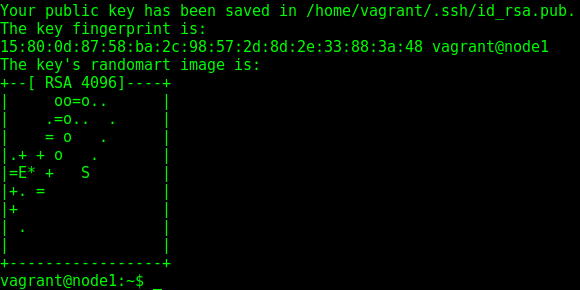
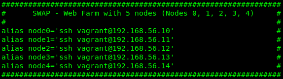
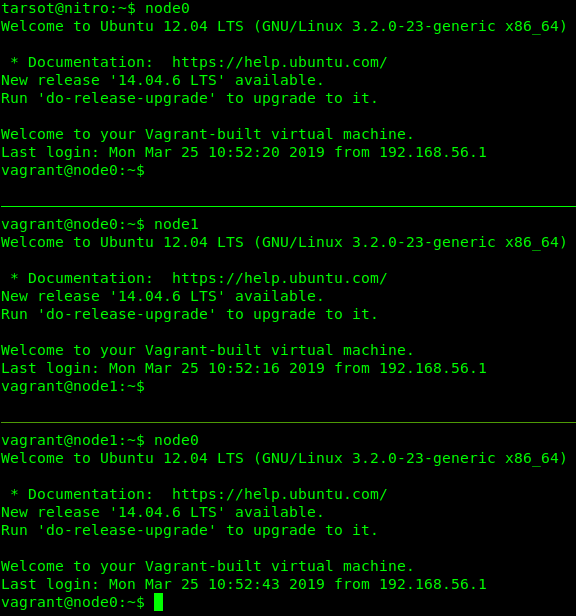
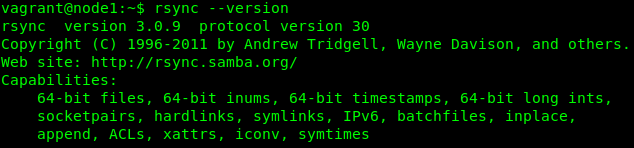
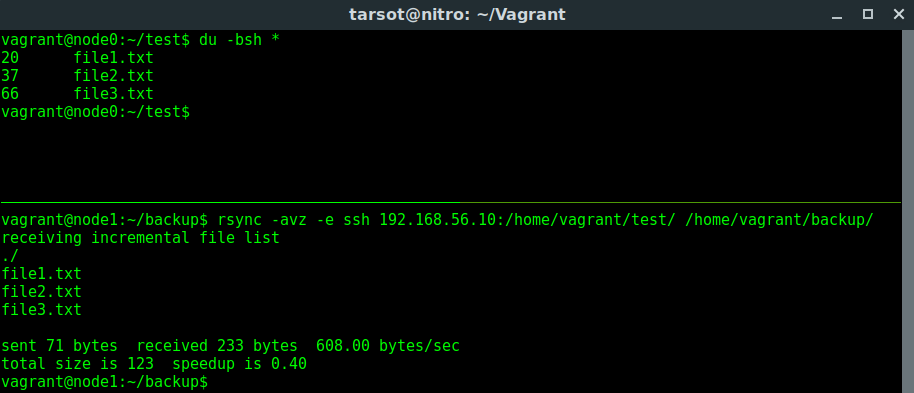
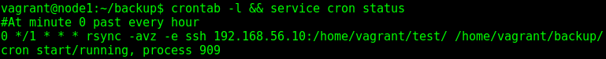
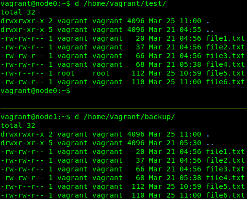

### Práctica 2. Clonar la información de un sitio web

Continuando con nuestro esquema anterior, los nodos mantienen análoga disposición:

|   **Node0**   |   **Node1**   |
| ------------- | ------------- |
| Web Server 1  | Web Server 2  | 
| 192.168.56.10 | 192.168.56.11 |

Como punto de partida y para un uso posterior de las copias realizadas, a través de rsync, generaremos las claves SSH para su uso sin contraseña. Esto, nos permitirá utilizar *rsync* desde scripts que se ejecuten automáticamente con el cron del sistema.

En la máquina secundaria, ejecutamos *ssh-keygen -b 4096 -t rsa*, observando la salida:

Antes de probar las copias automatizadas e incrementales, nos aseguramos que los nodos se conectan sin fallos. Previamente, hemos copiado la clave pública a nuestra primer nodo, con el comando *ssh-copy-id node0*. Para más detalle, dejo las capturas, que aclaran el proceso:

Configuración del archivo .bashrc (desde el SO anfitrión), para el acceso a todos los nodos:

Acceso garantizado (por SSH) sin solicitar contraseña:

A continuación, comprobamos la versión de *rsync* instalada en nuestro nodo destino:

Para probar el funcionamiento del *rsync*, clonaremos una carpeta cualquiera con sus correspondientes archivos, mostrando el resultado como sigue:

Finalmente, programaremos el cron (a través de /etc/contrab), como podemos observar:

En la siguiente captura, observamos el correcto funcionamiento que hemos programado anteriormente:

