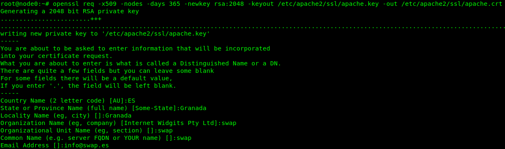
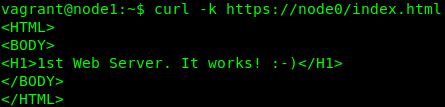
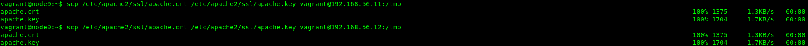
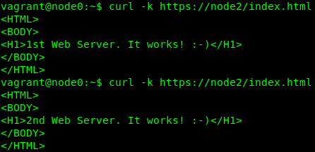
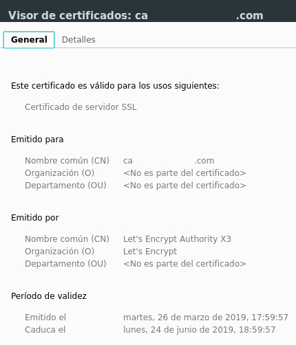

### Práctica 4. Asegurar la granja web 

Agregamos un nuevo nodo al esquema anterior, con la función de cortafuegos (FW):

|   **Node0**	|   **Node1**   |   **Node2**   |   **Node3**   |
| :-----------: | :-----------: | :-----------: | :-----------: |
| Web Server 1  | Web Server 2  | Load Balancer | Firewall      |
| 192.168.56.10 | 192.168.56.11 | 192.168.56.12 | 192.168.56.13 |

El objetivo de esta práctica es: instalar un certificado SSL para configurar el acceso a nuestros servidores, de modo seguro, a través del puerto 443 (HTTPS).

#### Generar e instalar un certificado autofirmado

Para ello, activamos el módulo SSL de Apache, de modo que se generan los certificados y especificamos la ruta de configuración:

	vagrant@node0:~$ a2enmod ssl
	vagrant@node0:~$ service apache2 restart
	vagrant@node0:~$ mkdir /etc/apache2/ssl
	vagrant@node0:~$ openssl req -x509 -nodes -days 365 -newkey rsa:2048 -keyout
	/etc/apache2/ssl/apache.key -out /etc/apache2/ssl/apache.crt

Editamos el archivo de configuración del sitio default-ssl:

	vagrant@node0:~$  nano /etc/apache2/sites-available/default-ssl

Y agregamos estas lineas debajo de donde pone SSLEngine on:

	vagrant@node0:~$ SSLCertificateFile /etc/apache2/ssl/apache.crt
	vagrant@node0:~$ SSLCertificateKeyFile /etc/apache2/ssl/apache.key

Activamos el sitio default-ssl y reiniciamos apache:
	
	vagrant@node0:~$ a2ensite default-ssl
	vagrant@node0:~$ service apache2 reload

Hacemos una petición usando la herramienta curl:

Necesitamos que la granja web nos permita usar el protocolo HTTPS, por lo que debemos
configurar el balanceador para que también acepte este tráfico (puerto 443). 

De ese modoo, copiaremos la pareja de archivos (el .crt y el .key) a todas las máquinas de la granja web (Web Server 2 y LB):

En el segundo servidor (node1), debemos activar el sitio *default-ssl* y reiniciar apache (como hicimos en el primer servidor). En el balanceador (node2) pondremos la ruta a la carpeta donde hayamos copiado los archivos *apache.crt* y el *apache.key*. Después, en el balanceador *nginx*, debemos añadir:

	vagrant@node2:~$ /etc/nginx/conf.d/default.conf
	
	listen 443 ssl;
	ssl on;
	ssl_certificate
	ssl_certificate_key
	/tmp/apache.crt;
	/tmp/apache.key;

	Reiniciamos el LB server:

	vagrant@node2:~$ sudo service nginx restart

Y le hacemos peticiones (por HTTPS) a la IP del balanceador:

- - -

#### Generar e instalar un certificado SSL/TLS, a tavés del proveedor Let's Encrypt

Dado que tengo un par de dominios activos, he aprovechado para utilizar el cliente *Certbot*, utilizando el software que nos proporciona la autoridad competente para ello.

En el host anfitrión, he seguido los pasos recomendados para la instalación sobre Apache:

	$ sudo apt-get update
	$ sudo apt-get install software-properties-common
	$ sudo add-apt-repository universe
	$ sudo add-apt-repository ppa:certbot/certbot
	$ sudo apt-get update
	$ sudo apt-get install certbot python-certbot-apache 

#### · Validación DNS ·

Para que este paso resulte satisfactorio, es necesario tener los accesos a la configuración del dominio, dado que necesitaremos agregar campos tipo TXT.

	$ certbot -d swap.domain.com --manual --preferred-challenges dns certonly

	Please deploy a DNS TXT record under the name
	_acme-challenge.domain.com with the following value:

	437drNmQL3vX6bu8ZYlgy0wKNBlCny9yrjF1lSaUnae <- *token inventado, por seguridad*

	Once this is deployed,
	Press ENTER to continue

	Waiting for verification...
	Cleaning up challenges
	IMPORTANT NOTES:
	 - Congratulations! Your certificate and chain have been saved at:
	   /etc/letsencrypt/live/domain.com/fullchain.pem
	   Your key file has been saved at:
	   /etc/letsencrypt/live/domain.com/privkey.pem
	   Your cert will expire on 2019-06-24. To obtain a new or tweaked
	   version of this certificate in the future, simply run certbot-auto
	   again. To non-interactively renew *all* of your certificates, run
	   "certbot-auto renew"
	 - If you like Certbot, please consider supporting our work by:
	Donating to ISRG / Let's Encrypt:   https://letsencrypt.org/d

	Listo, el certificado se ha instalado correctamente. Podemos probar que, efectivamente, funciona:

 

Se oculta el dominio completo, para preservar la seguridad.

A través de curl:

	tarsot@pundit:~$ curl -k https://swap.domain.com:85
	
	<HTML>
	<BODY>
	<H1>SWAP SSL WebServer. It works! :-)</H1>
	</BODY>
	</HTML>

- - -

#### Instalación y configuración del cortafuegos con *iptables*

En primer lugar, verificamos el estado de nuestro cortafuegos, en la máquina destinada (node3):

	vagrant@node3:~$ iptables -L -n -v

	Chain INPUT (policy DROP 0 packets, 0 bytes)
 	pkts bytes target     prot opt in     out     source               destination         

	Chain FORWARD (policy DROP 0 packets, 0 bytes)
 	pkts bytes target     prot opt in     out     source               destination         

	Chain OUTPUT (policy DROP 0 packets, 0 bytes)
 	pkts bytes target     prot opt in     out     source               destination 

 De nuevo, he h  uso de un nuevo menú de configuración, donde haré las pruebas a través de un *script* de programación:

         ---------------------------------
         TARSOT'S FIREWALL SERVICE (Node3)
         ---------------------------------

         Choose your option:
        
         1) Enable FW  | 2) Disable FW
         3) Curl HTTP  | 4) Curl HTTPS
         
         7) View FW Script
         9) Test Iptables
         0) Exit"
         
         Option:

 Con la opción 1), activaremos el cortafuegos. Observamos que: las conexiones orientadas a los puertos 80 y 443, se redireccionan al balanceador de carga, de modo que puede servir la web.

	#!/bin/sh

	# Delete all rules (clean configuration)
	iptables -F
	iptables -X
	iptables -Z
	iptables -t nat -F

	# Block incoming traffic
	iptables -P INPUT DROP
	iptables -P FORWARD DROP
	iptables -P OUTPUT ACCEPT
	iptables -A INPUT -m state --state NEW,ESTABLISHED -j ACCEPT

	# Allow forwarding
	iptables -P FORWARD ACCEPT

	# Allow any access from localhost
	iptables -A INPUT -i lo -j ACCEPT
	iptables -A OUTPUT -o lo -j ACCEPT

	# Allow SSH
	iptables -A INPUT -p tcp --dport 22 -m state --state NEW,ESTABLISHED -j ACCEPT
	iptables -A OUTPUT -p tcp --sport 22 -m state --state ESTABLISHED -j ACCEPT

	# Allow port 80 (http)
	iptables -A INPUT -p tcp --dport 80 -m state --state NEW,ESTABLISHED -j ACCEPT
	iptables -A OUTPUT -p tcp --sport 80 -m state --state ESTABLISHED -j ACCEPT

	# Allow port 443 (https)
	iptables -A INPUT -p tcp --dport 443 -m state --state NEW,ESTABLISHED -j ACCEPT
	iptables -A OUTPUT -p tcp --sport 443 -m state --state ESTABLISHED -j ACCEPT

	# Block ping (from outside to inside)
	iptables -A INPUT -p icmp --icmp-type echo-request -j DROP

	# Allow ping (from outside to inside)
	#iptables -A INPUT -p icmp --icmp-type echo-request -j ACCEPT
	#iptables -A OUTPUT -p icmp --icmp-type echo-reply -j ACCEPT

	# Allow ping (from inside to outside)
	iptables -A OUTPUT -p icmp --icmp-type echo-request -j ACCEPT
	iptables -A INPUT -p icmp --icmp-type echo-reply -j ACCEPT

	# Allowed DNS
	iptables -A OUTPUT -p udp --dport 53 -m state --state NEW,ESTABLISHED -j ACCEPT
	iptables -A INPUT -p udp --sport 53 -m state --state ESTABLISHED -j ACCEPT
	iptables -A OUTPUT -p tcp --dport 53 -m state --state NEW,ESTABLISHED -j ACCEPT
	iptables -A INPUT -p tcp --sport 53 -m state --state ESTABLISHED -j ACCEPT

	# Allow redirection between machines
	echo 1 > /proc/sys/net/ipv4/ip_forward

	# HTTP redirection
	iptables -t nat -A PREROUTING -p tcp --dport 80 -j DNAT --to 192.168.56.12:80
	iptables -A FORWARD -d 192.168.56.12 -p tcp --dport 80 -j ACCEPT

	# HTTPS redirection
	iptables -t nat -A PREROUTING -p tcp --dport 443 -j DNAT --to 192.168.56.12:443
	iptables -A FORWARD -d 192.168.56.12 -p tcp --dport 443 -j ACCEPT

	# Nat Masquerade
	iptables -t nat -A POSTROUTING -j MASQUERADE

Como podemos ver en el *script* que precede, existen varias reglas que permiten el acceso a través de diversos puertos: SSH, HTTP, HTTPS y DNS.

	Una prueba más, a través de *curl*:

	vagrant@node0:~$ curl node2
	<HTML>
    <BODY>
    <H1>1st Web Server. It works! :-)</H1>
    </BODY>
    </HTML>
    
    vagrant@node0:~$ curl node2
    <HTML>
    <BODY>
    <H1>2nd Web Server. It works! :-)</H1>
    </BODY>
    </HTML>

	vagrant@node0:~$ curl -k https://node2
	<HTML>
    <BODY>
    <H1>1st Web Server. It works! :-)</H1>
    </BODY>
    </HTML>
    
    vagrant@node0:~$ curl -k https://node2
    <HTML>
    <BODY>
    <H1>2nd Web Server. It works! :-)</H1>
    </BODY>
    </HTML>

